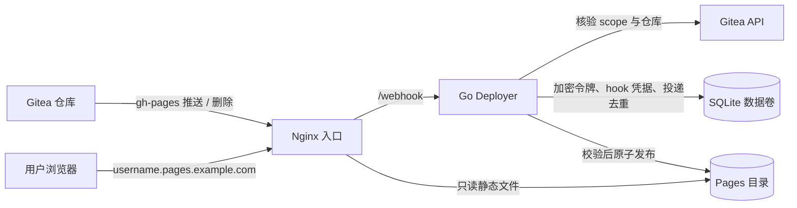
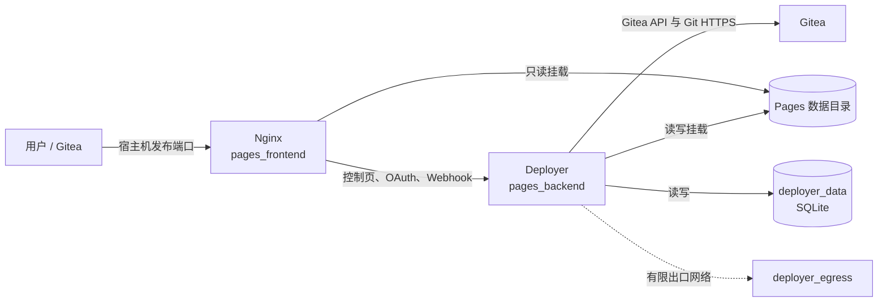
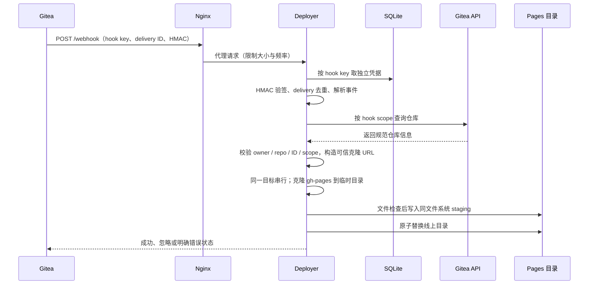

# Gitea Pages 项目导览

这份导览按“先看整体，再定位细节”的顺序介绍项目。部署参数以 [`.env.example`](../.env.example) 和 [`docker-compose.yml`](../docker-compose.yml) 为准；安全约束以 [`AI.md`](../AI.md) 和 [`security.md`](security.md) 为准。

## 1. 30 秒了解项目

| 输入 | 系统处理 | 结果 |
|---|---|---|
| Gitea 仓库的 `gh-pages` 分支推送 | 验证 hook、向 Gitea 核对仓库、克隆并检查站点文件 | 自动发布静态站点 |
| `gh-pages` 分支删除 | 验证删除事件及仓库归属 | 安全移除对应站点 |
| 用户访问站点域名 | Nginx 按用户名和路径读取已发布文件 | 返回静态内容 |

**一句话：**它用 Gitea Webhook 驱动静态站点部署；Nginx 负责入口和只读服务，Go Deployer 负责授权校验、Git 获取与原子发布。



## 2. 站点如何对应到仓库

| 站点类型 | 仓库名约定 | 访问地址 | Pages 目录 |
|---|---|---|---|
| 用户根站点 | `<用户名>.<完整 Pages 域名>`，例如 `alice.pages.example.com` | `https://alice.pages.example.com/` | `<PAGES_DATA_DIR>/alice/_root/` |
| 子站点 | 任意仓库名，例如 `blog` | `https://alice.pages.example.com/blog/` | `<PAGES_DATA_DIR>/alice/blog/` |

所有者来自经 Gitea API 核验的仓库。路径组件经过校验；Webhook 本身不能指定发布路径、克隆地址或访问令牌。

## 3. 运行架构与请求路径

### 网络与容器



| 组件 | 职责 | 关键边界 |
|---|---|---|
| **Nginx** | 精确区分控制域名与用户子域名；代理控制请求；提供静态文件 | 唯一发布宿主机端口；静态目录只读挂载；拒绝未知 Host、隐藏路径及 `_root` 内部路径 |
| **Deployer** | OAuth、hook 注册和验证、Gitea 仓库核验、Git 克隆、站点发布 | 无宿主机端口；只在后端网络接收 Nginx 请求；唯一写入 Pages 目录的服务 |
| **Gitea** | OAuth 授权、仓库与组织元数据、Webhook 投递、Git 仓库 | 仓库和克隆来源以配置的 Gitea 实例为准 |
| **SQLite 数据卷** | 持久化加密 OAuth 令牌、hook 凭据和投递去重记录 | 加密密钥由独立 secret 文件提供 |
| **Pages 数据目录** | 保存当前发布的网站文件 | Deployer 读写，Nginx 只读；不保存 Git 工作区 |

Compose 默认只将 Nginx 的容器 `8080` 映射到宿主机 `80`；生产 HTTPS 由部署环境的外部入口提供。Deployer 的 `8080` 仅供 Compose 内部访问。

### HTTP 路由

| 路径 | 用途 | 入口与限制 |
|---|---|---|
| `/`、`/status` | 首页、当前授权状态 | 控制域名代理至 Deployer |
| `/oauth/start`、`/oauth/authorize`、`/oauth/callback` | OAuth 授权和回调 | OAuth 已配置时启用；回调使用配置的固定 URL 和一次性 state |
| `/webhook` | Gitea push / delete 投递 | 控制域名；仅 POST；Nginx 限制请求体及速率，Deployer 再验签 |
| `/health` | Deployer 存活检查 | Deployer 内部端口 |
| `http://127.0.0.1:8081/health` | Nginx 存活检查 | 容器回环地址，不对外发布 |
| 用户子域名及路径 | 静态站点 | Nginx 从 Pages 目录只读提供 |

## 4. 两条核心业务流程

### Webhook 到站点发布



处理顺序是安全边界的一部分：

1. Webhook 仅接受 POST，读取最多 **1 MiB** 的 body；hook key 只用于查找凭据，HMAC-SHA256 才证明投递可信，并拒绝重复 delivery ID。
2. 只处理 push 和 delete；仓库 ID、所有者与名称再通过 Gitea API 核对。组织 hook 只能操作对应组织；不能从 payload 选 OAuth token 或克隆 URL。
3. 仅 `gh-pages` 分支触发发布或移除。仓库大小、克隆时长、站点大小及并发数都有限制；同一站点目标不会并行发布。
4. 暂存发布会拒绝符号链接、特殊文件和危险权限位；排除 `.git` 元数据目录，发布目录/文件权限统一为 `0755`/`0644`。普通点号文件/目录会随站点复制。Nginx 仍拒绝隐藏 URL（例如 `/.env`），所以“文件被复制”不代表“可从站点 URL 访问”。
5. Linux 上通过目录文件描述符完成安全的原子替换和删除。下载、校验或复制失败时不切换线上目录；非 Linux 构建会明确报告该平台不支持安全替换/删除。

### OAuth 与 hook 注册

```mermaid
flowchart LR
    U[用户浏览器] -->|授权请求 + state| G[Gitea OAuth]
    G -->|授权码| C[Deployer 回调]
    C -->|交换令牌、读取用户| G
    C -->|AES-GCM 加密后保存| DB[(SQLite)]
    C -->|按用户 / 组织生成独立凭据| H[Gitea scoped Webhook]
    H -->|后续投递| W[/webhook]
```

OAuth scope 默认包含 `read:user`、`write:user`、`read:repository`，并在 `PAGES_ENABLE_ORGANIZATION_HOOKS=true` 时包含 `write:organization`。组织 hook 使用已授权的组织管理员 token 池；可按安装策略关闭组织 hook。访问令牌以 AES-256-GCM 加密保存，会话和 OAuth 客户端密钥来自 secret 文件。

## 5. 代码与目录地图

### Go 服务（`deployer/`）

| 文件 | 负责内容 |
|---|---|
| `main.go` | 配置读取与校验、依赖初始化、HTTP 路由、服务启动 |
| `oauth.go`、`web.go` | OAuth 流程、令牌刷新、个人/组织 hook 注册、首页与授权状态页 |
| `hook_auth.go`、`handler.go` | Webhook 认证、重放防护、事件处理及 HTTP 错误映射 |
| `repository_verifier.go`、`gitea.go` | Gitea API 核验、scope 授权、规范仓库信息与可信克隆地址 |
| `storage.go`、`token_crypto.go` | SQLite 持久化、令牌加密、hook 凭据和 delivery 去重 |
| `deployment_limiter.go`、`git.go` | 并发控制、克隆、站点文件筛选、staging 发布与删除 |
| `site_target.go`、`security.go` | 站点路径构造、路径与文件安全检查、日志脱敏 |
| `atomic_replace_linux.go`、`atomic_replace_unsupported.go` | Linux 安全原子发布/删除；其他平台显式拒绝这些操作 |
| `*_test.go` | 同包单元测试、端到端安全回归及 Linux 文件系统测试 |

Go 服务使用标准库 HTTP 服务和 `modernc.org/sqlite`（纯 Go SQLite 驱动）；Git 由容器内 `git` 命令执行。

### 仓库根目录

| 路径 | 阅读目的 |
|---|---|
| `docker-compose.yml`、`.env.example` | 唯一的服务拓扑、网络、挂载、资源限制与运行参数 |
| `nginx/` | 域名路由、反向代理、静态文件规则及非 root 容器镜像 |
| `tests/` | Bash 安全发布门禁、Compose 隔离检查和 Nginx 集成测试 |
| `examples/quickstart/README.md` | 加固后的部署步骤；不再提供旧式一体化测试栈 |
| `AI.md` | 修改代码时必须保持的当前架构和安全契约 |
| `docs/security.md` | 密钥轮换、安全发布与事件响应 |
| `.github/workflows/security.yml` | CI 验证、安全扫描及多架构镜像发布 |

## 6. 配置与持久化

`.env.example` 是 Compose 的公共配置入口；变量统一使用 `PAGES_` 前缀，再映射为容器内部配置。生产敏感值放在文件中，不能放进 `.env`。

| 配置组 | 变量 | 默认 / 说明 |
|---|---|---|
| 域名和入口 | `PAGES_DOMAIN`、`PAGES_HTTP_PORT` | 必填完整 Pages 域名；宿主机 HTTP 端口默认 `80` |
| 数据目录 | `PAGES_DATA_DIR` | 默认 `./pages/webroot`；Deployer 写，Nginx 只读 |
| Gitea | `PAGES_GITEA_API_URL`、`PAGES_GITEA_PUBLIC_URL` | API URL 必填；公开 Git 地址可选，未设置时沿用 API URL |
| OAuth | `PAGES_OAUTH_CLIENT_ID` | 必填；Gitea 回调为 `https://<PAGES_DOMAIN>/oauth/callback` |
| 文件密钥 | `PAGES_SESSION_SECRET_HOST_FILE` | 会话签名密钥，至少 32 字节 |
| 文件密钥 | `PAGES_TOKEN_ENCRYPTION_KEY_HOST_FILE` | 必填，原始二进制，**恰好 32 字节**；丢失将无法解密令牌 |
| 文件密钥 | `PAGES_OAUTH_CLIENT_SECRET_HOST_FILE` | OAuth 客户端密钥 |
| 资源限制 | `PAGES_MAX_SITE_SIZE_MB`、`PAGES_MAX_REPOSITORY_SIZE_MB` | 默认 `100 MB`、`1024 MB` |
| 资源限制 | `PAGES_MAX_CONCURRENT_DEPLOYS`、`PAGES_CLONE_TIMEOUT`、`PAGES_ACQUIRE_TIMEOUT` | 默认 `4`、`1m`、`30s` |
| 功能开关 | `PAGES_ENABLE_ORGANIZATION_HOOKS` | 默认 `true`；关闭后仅注册个人 hook |
| 容器身份 | `PAGES_UID`、`PAGES_GID` | 默认 `1000:1000`；须能读写数据目录并读取 Compose secrets |

| 持久数据 | 位置 | 作用 |
|---|---|---|
| 已发布站点 | 宿主机 `PAGES_DATA_DIR` | Nginx 当前提供的静态文件；按用户与仓库目录组织 |
| Deployer 数据 | Compose 命名卷 `gitea-pages-deployer-data`，容器内 `/var/lib/deployer` | SQLite 凭据与去重状态 |
| Secret 文件 | `.env` 指定的宿主机路径 | Compose 挂载到 `/run/secrets/`；与数据库、镜像及日志分离 |

## 7. 安全设计速览

| 风险输入 | 主要控制 |
|---|---|
| 伪造、重放或超大 Webhook | 独立 hook key/secret；HMAC-SHA256；delivery ID 去重；body 1 MiB 上限；Nginx 速率限制 |
| payload 冒充仓库或组织 | 以 hook scope 为授权主体；调用 Gitea API 复核仓库 ID、owner、名称；克隆 URL 从配置的 Gitea 来源构造 |
| 恶意 Git 内容 | HTTPS 克隆；限制仓库/站点大小和时间；阻止符号链接、特殊文件、危险权限；剥离 `.git`。普通点号文件会发布，但 Nginx 禁止访问隐藏 URL |
| 发布期间失败或并发竞争 | 同一目标串行；同文件系统 staging；Linux 原子替换/删除 |
| 容器或网络越权 | 仅 Nginx 发布端口；非 root、只读根文件系统、丢弃全部 capabilities、`no-new-privileges`、资源限制；Deployer 无 Docker socket 与 SSH key |
| 令牌、密钥泄露 | OAuth token AES-256-GCM 加密；密钥以文件 secret 提供；日志不记录 hook header、签名或 payload |

旧版明文 token 数据库和共享 Webhook Secret 不受支持；升级时使用新的 Deployer 数据卷并重新完成 OAuth。故障处置以 [`docs/security.md`](security.md) 为准。

## 8. 如何构建、验证和继续阅读

Go 版本以 CI 固定的 **1.26.7** 为准。在 Linux 或 WSL 中运行文件系统与 Docker 检查：

```bash
cd deployer
go build ./...
go vet ./...
go test -race -coverprofile=coverage.out ./...
govulncheck ./...       # CI 固定版本 v1.6.0

cd ..
docker compose --env-file .env.example config --quiet
bash tests/security_release_gate_test.sh
bash tests/compose_security_test.sh
bash tests/nginx_test.sh
```

| 验证 | 覆盖内容 |
|---|---|
| Go 测试 | OAuth、Webhook、仓库核验、并发、发布及安全回归 |
| Compose 检查 | 服务网络、非 root、secret、只读挂载及资源限制 |
| Nginx 测试 | 域名路由、静态文件、隐藏路径、Webhook 限流/大小与容器运行约束 |
| CI 安全扫描 | `govulncheck`、Trivy Compose 配置扫描和镜像扫描 |

**建议阅读顺序：**本导览 → [`README.md`](../README.md) 的快速部署与 OAuth 配置 → [`examples/quickstart/README.md`](../examples/quickstart/README.md) → [`AI.md`](../AI.md) → [`docs/security.md`](security.md)。
